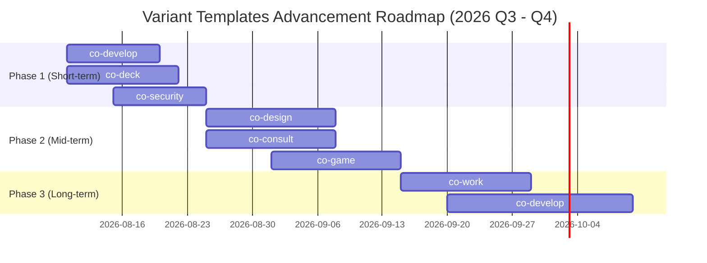

# Meeting: Variant Templates Benchmark & Advancement Plan

**Date**: 2026-08-06  
**Facilitator**: PM  
**Participants**: PM, Architect, Automation Engineer, Security Expert, Docs Writer, Auditor, Scaffolding Expert  
**Topic**: Comprehensive GitHub open-source benchmarking across all 7 workspace variant templates (`templates/co-*`) and formulation of concrete, domain-specific advancement plans.

---

## Agenda

1. Benchmark each of the 7 variant templates against top-tier GitHub open-source projects, industry frameworks, and state-of-the-art AI developer tools.
2. Identify core technical gaps, architectural opportunities, and feature enhancements for each domain.
3. Formulate concrete, actionable implementation plans and prioritize roadmap items across 3 phases (Short-term, Mid-term, Long-term).

---

## Benchmark Analysis & Advancement Plans by Variant

### 1. 🛠️ `co-develop` — Software Engineering & Full-Stack Development

- **GitHub Benchmarks**: [MetaGPT](https://github.com/geekan/MetaGPT), [SWE-agent](https://github.com/SWE-agent/SWE-agent), [Vercel AI SDK](https://github.com/vercel/ai), [Cursor `.cursorrules`](https://github.com/cursor-ai)
- **Current State**: Stable 7-agent engineering workflow (`pm`, `architect`, `code-writer`, `designer`, `security-monitor`, `stack-setup`, `test-runner`).
- **Core Gaps & Opportunities**:
  1. **IDE Context Integration**: Lacks automatic generation of editor-level guidance files (`.cursorrules`, `.clauderules`, `.copilotinstructions`) during scaffolding.
  2. **Autonomous Issue-to-PR Pipeline**: SWE-agent-style workflow for autonomous feature/bugfix resolution with automated regression testing.
  3. **Strict Schema Contracts**: Frontend/Backend communication lacks mandatory runtime Zod schema validation.
- **Concrete Advancement Plan**:
  - **Advancement 1.1**: Add `.cursorrules` & `.clauderules` generator to `new-project.ts` scaffolding to sync IDE agents with project context.
  - **Advancement 1.2**: Implement an autonomous `swe-solve` skill for `co-develop` that takes an issue description, creates a branch, implements tests, writes code, and opens a PR.
  - **Advancement 1.3**: Mandate Zod schema validation across all internal API contracts.

---

### 2. 🎨 `co-design` — UI/UX Architecture & Design System

- **GitHub Benchmarks**: [shadcn/ui](https://github.com/shadcn-ui/ui), [Storybook 8](https://github.com/storybookjs/storybook), [Penpot](https://github.com/penpot/penpot), [v0.dev](https://v0.dev)
- **Current State**: Stable 8-agent design team (`design pm`, `design-lead`, `prototype-engineer`, `service-designer`, `storyteller`, `typography-expert`, `ux-researcher`, `visual-designer`).
- **Core Gaps & Opportunities**:
  1. **Design Token Single Source of Truth**: Token definitions are text-based rather than machine-readable JSON/CSS custom properties.
  2. **Automated Accessibility (a11y) & Visual Audit**: Lacks `axe-core` accessibility scoring and automated Playwright screenshot visual regression testing.
  3. **Interactive Component Showcase**: No lightweight auto-generated component playground.
- **Concrete Advancement Plan**:
  - **Advancement 2.1**: Implement a unified `tokens.json` schema that compiles directly to CSS custom properties (`:root { --color-primary... }`) and TypeScript types.
  - **Advancement 2.2**: Integrate `axe-core` accessibility audit into `co-design` QA gate for WCAG 2.1 AA compliance.
  - **Advancement 2.3**: Auto-scaffold a Vite-based single-file HTML component playground for instant visual component inspection.

---

### 3. 💼 `co-consult` — Strategy Consulting & Market Intelligence

- **GitHub Benchmarks**: [OpenBB Terminal](https://github.com/OpenBB-finance/OpenBBTerminal), [Palantir Foundry Docs](https://www.palantir.com/platforms/foundry/), [BloombergGPT Papers](https://arxiv.org/abs/2303.17564)
- **Current State**: Stable 11-agent team with 16 domain skills (`company-intelligence`, `k-dart`, financial modeling, market analysis).
- **Core Gaps & Opportunities**:
  1. **Live Disclosures API Parsing**: `k-dart` skill parses static files; lacks automated DART/EDGAR REST API real-time extraction.
  2. **MECE Logical Tree Auditor**: Consulting reports require rigorous MECE (Mutually Exclusive, Collectively Exhaustive) structuring.
  3. **Interactive Executive Dashboards**: Lacks automated generation of single-file interactive HTML dashboards for client presentations.
- **Concrete Advancement Plan**:
  - **Advancement 3.1**: Upgrade `k-dart` skill to interface directly with DART Open API for automated financial statement & 10-K disclosure ingestion.
  - **Advancement 3.2**: Add a `mece-auditor` check within `deliverable-writer` agent to validate logical hierarchy in executive summaries.
  - **Advancement 3.3**: Integrate `explain-me` skill into `co-consult` to auto-compile consulting outputs into interactive single-page HTML executive dashboards with Chart.js visualization.

---

### 4. 📊 `co-deck` — Presentation & Lecture Deck Production

- **GitHub Benchmarks**: [Slidev](https://github.com/slidevjs/slidev), [Marp](https://github.com/marp-team/marp), [Reveal.js](https://github.com/hakimel/reveal.js), [NotebookLM](https://notebooklm.google.com/)
- **Current State**: Beta 13-agent workflow with multi-theme HTML-to-PDF pipeline, sticky topbar, TOC drawer, and TTS voice selection.
- **Core Gaps & Opportunities**:
  1. **Dual-Screen Presenter Mode**: Lacks a real-time web presenter view (synchronized slide window + speaker notes + timer).
  2. **Multi-Speaker Audio Dialogue**: TTS pipeline supports single-narrator audio; lacks dual-speaker podcast-style discussion generation.
  3. **Vector SVG & High-DPI PDF Export**: PDF generation needs zero-truncation guarantee across custom slide dimensions.
- **Concrete Advancement Plan**:
  - **Advancement 4.1**: Implement a lightweight HTML5 dual-window Presenter Mode with synchronized BroadcastChannel messaging.
  - **Advancement 4.2**: Upgrade TTS voice engine to support multi-speaker dialogues (Instructor & Student Q&A mode).
  - **Advancement 4.3**: Integrate Playwright paged-media PDF renderer with CSS `@page` page-break controls for perfect slide export.

---

### 5. 🎮 `co-game` — Game Design & Canvas Engine Scaffolding

- **GitHub Benchmarks**: [Phaser 3](https://github.com/phaserjs/phaser), [LittleJS](https://github.com/KilledByAPixel/LittleJS), [PixiJS](https://github.com/pixijs/pixijs), [jsfxr](https://github.com/gr2m/jsfxr)
- **Current State**: Beta 12-agent workflow for Vanilla TypeScript HTML5 Canvas game development.
- **Core Gaps & Opportunities**:
  1. **Decoupled Architecture**: Vanilla Canvas code often mixes game logic with rendering; needs lightweight ECS (Entity Component System) architecture.
  2. **Procedural Sound Synthesis**: Lacks zero-dependency sound effect generation (`jsfxr` / Web Audio API).
  3. **Instant Playable HTML Bundle**: Lacks single-file HTML game bundler for instant browser testing.
- **Concrete Advancement Plan**:
  - **Advancement 5.1**: Provide a clean 150-line TS Entity Component System (ECS) engine core in `co-game` templates.
  - **Advancement 5.2**: Add `sound-synth` skill leveraging Web Audio API / `jsfxr` for programmatic 8-bit sound effect generation (jump, hit, explosion, coin).
  - **Advancement 5.3**: Implement a `game-preview` script that bundles assets and TypeScript into a standalone `index.html` playable game file.

---

### 6. 🛡️ `co-security` — Security Audit, Threat Modeling & Compliance

- **GitHub Benchmarks**: [OWASP SAMM](https://github.com/OWASP/samm), [Semgrep](https://github.com/semgrep/semgrep), [Trivy](https://github.com/aquasecurity/trivy), [DefectDojo](https://github.com/OWASP/DefectDojo)
- **Current State**: Stable 6-agent security team (`sec-lead`, `threat-modeler`, `code-auditor`, `compliance-expert`, etc.).
- **Core Gaps & Opportunities**:
  1. **Automated STRIDE Matrix**: Threat modeling is free-form; lacks structured STRIDE & DREAD risk rating tables.
  2. **SBOM & Supply Chain Security**: Lacks automated Software Bill of Materials (SBOM) generation (SPDX/CycloneDX format).
  3. **SARIF Output Integration**: Lacks SARIF (Static Analysis Results Interchange Format) export for GitHub Security Code Scanning integration.
- **Concrete Advancement Plan**:
  - **Advancement 6.1**: Implement automated STRIDE threat modeling template with DREAD risk scoring in `threat-modeler`.
  - **Advancement 6.2**: Add `sbom-generate` script utilizing Bun package metadata to produce SPDX compliant SBOM files.
  - **Advancement 6.3**: Add SARIF report exporter to `code-auditor` to allow security findings to be posted directly into GitHub PR Checks.

---

### 7. 💼 `co-work` — Workplace Automation & Enterprise Documents

- **GitHub Benchmarks**: [n8n](https://github.com/n8n-io/n8n), [python-docx](https://github.com/python-openxml/python-docx), [exceljs](https://github.com/exceljs/exceljs), [Notion API](https://developers.notion.com/)
- **Current State**: Stable 7-agent workflow for enterprise documentation and MS365 integration.
- **Core Gaps & Opportunities**:
  1. **Markdown to Native Office OOXML Compiler**: Lacks direct compilation of markdown docs into formatted `.docx` and `.xlsx` files.
  2. **Automated Daily Digest & Standup Synthesizer**: Lacks automated aggregation of `memory/*.md` logs into Slack/Email team digests.
  3. **No-Code Workflow Connectors**: Needs standardized JSON config schemas for connecting agents to Notion/Slack APIs.
- **Concrete Advancement Plan**:
  - **Advancement 7.1**: Integrate TypeScript OOXML compiler (`docx` / `exceljs` helpers) in `co-work` to compile markdown reports into formatted Word & Excel files.
  - **Advancement 7.2**: Add `digest-generator` skill that aggregates session logs and opens PRs with daily team standup summaries.
  - **Advancement 7.3**: Create `connector-schema.json` for configuring external webhook triggers (Notion, Slack, Microsoft Teams).

---

## Master Advancement Roadmap

---

## Synthesized Action Plan Summary

| Variant | Top Action Item | Priority | Target Agent / Script |
|---|---|:---:---|
| `co-develop` | `.cursorrules` / `.clauderules` auto-generation on scaffolding | **High** | `scaffolding-expert` |
| `co-design` | Unified `tokens.json` design token system & CSS compilation | **High** | `ui-designer` / `architect` |
| `co-consult` | DART API live disclosure extraction & MECE logic auditor | **High** | `k-dart` / `deliverable-writer` |
| `co-deck` | Dual-window Presenter Mode & Multi-speaker audio narrator | **High** | `presentation-architect` |
| `co-game` | 150-line TS ECS core engine & `jsfxr` sound synthesizer | **Medium** | `game-programmer` |
| `co-security` | STRIDE threat matrix generator & SARIF PR security report | **High** | `threat-modeler` / `security-expert` |
| `co-work` | Markdown to OOXML (.docx/.xlsx) native document compiler | **Medium** | `work-coordinator` / `automation-engineer` |
