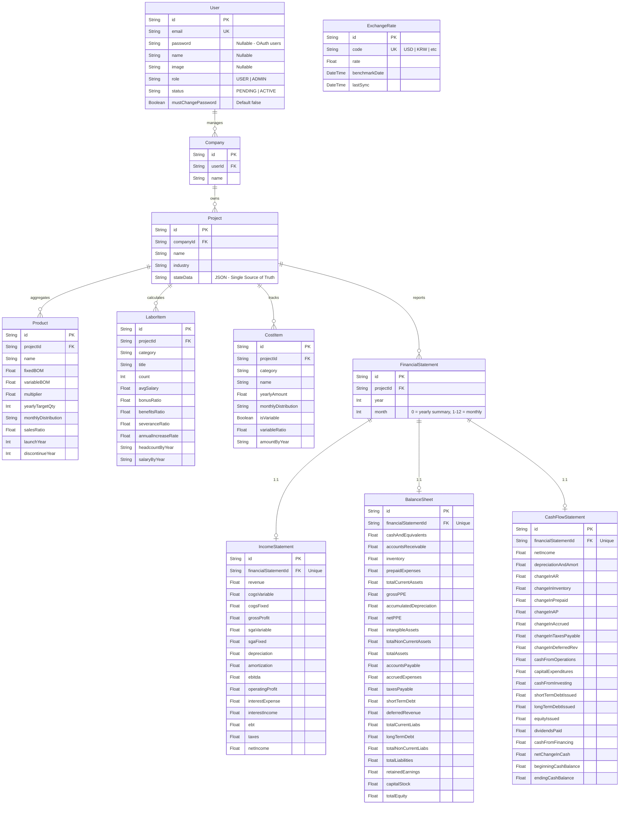

# ERD & Data Schema Reference v4.1 — Developer & AI Guide

This document defines the data architecture of the **AIG v4.1** platform, covering both the relational Prisma schema and the internal JSON state structure.

---

## 1. Relational Schema (Prisma Layer)

The system uses SQLite for persistent storage. The following diagram illustrates the relationship between core models.



---

## 2. Internal JSON Architecture (`SimulationState`)

The `Project.stateData` field contains the deeply nested `SimulationState` object, which is the primary input for the orchestrator.

### 2.1. Root Object Structure
```typescript
interface SimulationState {
  config: SimulationConfig;   // Global rules (Inflation, Scaling, Accrual cycles)
  products: ProductInfo[];     // Multi-year planning, BOM & Allocation
  labor: LaborItem[];         // Salaries, Ratios & Headcount
  expenses: CostItem[];       // Fixed/Variable SGA
  currency: CurrencyInfo;     // Exchange rates & Display logic
}
```

### 2.2. Critical Field Constraints (v4.1)
| Module | Field | Type | Rule |
|---|---|---|---|
| **Config** | `accruedExpensesDays` | `Integer` | Used for liability accrual in Cash Flow (Default: 14). Lives in `stateData.config`, not a Prisma column. |
| **Product** | `multiplier` | `Float` | MSRP multiplier (Default: 3.5). |
| **Labor** | `severanceRatio` | `Float` | Monthly severance accrual ratio (Default: 0.083 / 1 month). |
| **Expenses** | `calcMethod` | `Enum` | `revenue_ratio \| per_person \| direct_input`. Lives in the CostItem state type (`src/lib/types.ts`), not a Prisma column. |

---

## 3. Data Flow Integrity Rules

1.  **JSON Precedence**: The simulation runs primarily based on `stateData`. Relational tables are often used for efficient querying and dashboard listing.
2.  **Cascading Deletion**: Deleting a `User` cascades to `Company`, `Project`, and all associated sub-items.
3.  **Audit Consistency**: Core metadata (Project Name, Industry) in the DB columns MUST match the data inside `stateData` JSON.
4.  **Serialization**: Before saving to `stateData`, ensure all circular references are removed and numeric types are validated.
